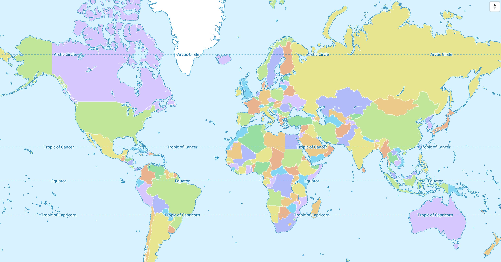

# Display your first map

Import the maplibre package and use the `MapLibreMap` widget to display a
map.

```dart
import 'package:flutter/material.dart';
import 'package:maplibre/maplibre.dart';

class MapScreen extends StatefulWidget {
  const MapScreen({super.key});

  @override
  State createState() => FullMapState();
}

class MapScreenState extends State<MapScreen> {
  MapController? _mapController;

  @override
  Widget build(BuildContext context) {
    return Scaffold(
      body: MapLibreMap(
        onMapCreated: (controller) {
          // Don't add additional annotations here,
          // wait for the onStyleLoadedCallback.
          _mapController = controller;
        },
        onStyleLoaded: () {
          debugPrint('Map loaded 😎');
        },
      ),
    );
  }
}
```

The result should look something like this:



If the map style isn't specified, the default MapLibre style is used. Use the 
style of a tile provider or create and use your own map style.