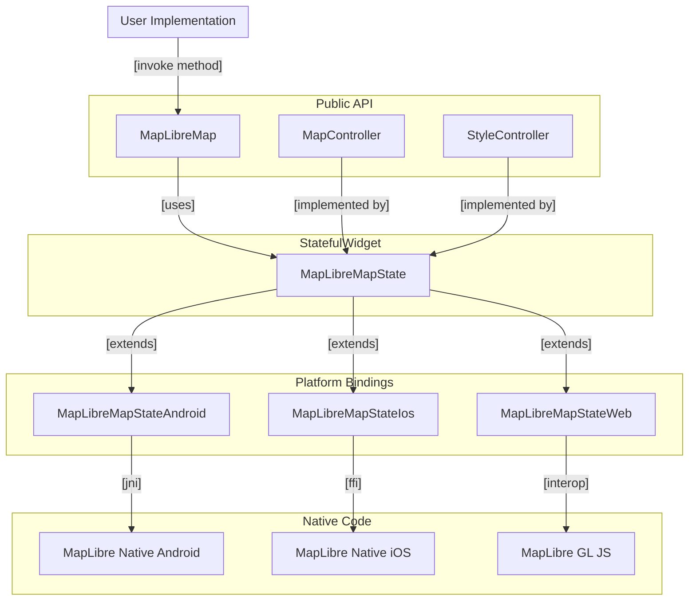
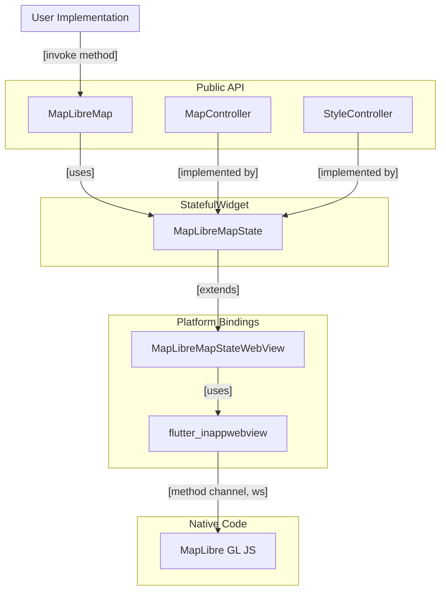

# Architecture

This page gives a small introduction in the architecture that is used
for `maplibre`.

## Abstraction Layers

### Android, iOS and Web

Android, iOS and Web use native interop to connect the Flutter/Dart code with
the native MapLibre code.

### Windows and MacOS (using a WebView)

The experimental Windows and MacOS implementations use a WebView to render the
map. The architecture is a bit different, because the WebView is used as a
platform view and the communication with the WebView is done using the
`flutter_inappwebview` package.

### 1. Public API

`MapLibreMap` and `MapController` is part of the public API. That part of the
package that users are in contact with.

### 2. MapLibreMapState

`MapLibreMapState` is an abstract base class for the `State<MapLibreMap`> and
contains implementations that are completely platform invariant.

### 3. MapLibreMapStateAndroid, -Ios, -Web

This is the last Flutter/Dart layer. These classes contain missing
implementations that haven't previously been implemented on an higher level.

This layer has the connection with the Native Code Layer using

- Method Channels with the Pigeon code generator
- JNI using JNIGEN to interop with Kotlin on Android
- FFI using FFIGEN to interop with Swift on iOS
- The WASM compatible interop with JavaScript using js_interop and package:web
  on Web.

### 4. Native Layer

The last and most low level layer that package uses. This layer handles Platform
View registration and the native implementation of Pigeon.
