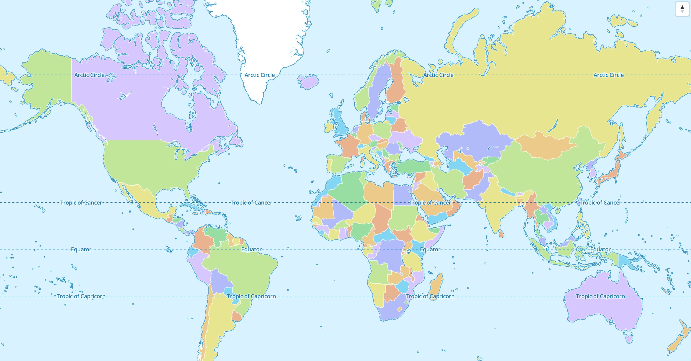

# Basic Usage

## Display your first Map

Import the maplibre package and use the `MapLibreMap` widget to display a
map.

```dart title="map_screen.dart" linenums="1" hl_lines="3 18-28"
import 'package:flutter/material.dart';

import 'package:maplibre/maplibre.dart';

class MapScreen extends StatefulWidget {
  const MapScreen({super.key});

  @override
  State createState() => FullMapState();
}

class MapScreenState extends State<MapScreen> {
  MapController? _mapController;

  @override
  Widget build(BuildContext context) {
    return Scaffold(
      body: MapLibreMap(
        onMapCreated: (controller) {
          // Store the map controller for later use. You can use it to control 
          // the map programmatically.
          _mapController = controller;
        },
        onStyleLoaded: (style) {
          // Add your sources and layers here or do any other setup after the 
          // style has been loaded.
          debugPrint('Map loaded 😎');
        },
      ),
    );
  }
}
```

The result should look something like this:



If the map style isn't specified,
the [default MapLibre style](https://github.com/maplibre/demotiles?tab=readme-ov-file#maplibre-world-demo-map)
is used. Read the [Styles](../styles) chapter to learn how to use other styles.

## Programmatic Control

It is possible to update or change the `MapLibreMap` widget during its lifetime.

### The `MapLibreMap` widget

The `MapLibreMap` is used to specify
initial values. Parameters that don't begin with `init*` can be updated in a
declarative way just like any other Flutter Widget. The most simple way is to
use the `MapLibreMap` widget in a `StatefulWidget` and calling `setState()`.

```dart linenums="1" hl_lines="11 22-24 29-31"
@immutable
class MyMapWidget extends StatefulWidget {
  const MyMapWidget({super.key});

  @override
  State<MyMapWidget> createState() => _MyMapWidget();
}

class _MyMapWidget extends State<GesturesPage> {
  // Using this field to store the widget state
  bool _gesturesEnabed = true;

  @override
  Widget build(BuildContext context) {
    return Scaffold(
      body: MapLibreMap(
          options: MapOptions(
            // parameters that start with init* can't be updated
            initCenter: Geographic(lon: 9.17, lat: 47.68),
            initZoom: 3,
            // other parameters can be updated
            gestures: _gesturesEnabled
                ? MapGestures.all()
                : MapGestures.none(),
          ),
          onEvent: (event) {
            if (event case MapEventClick()) {
              // update the map widget using Flutters' state management
              setState() {
                _gesturesEnabed = !_gesturesEnabed;
              }
            }
          }
      ),
    );
  }
}
```

All parameters that start with `init*` can't be updated using this method and
need to use the [MapController](#the-mapcontroller) or
the [StyleController](#the-stylecontroller).

### The `MapController`

The `MapController` can be used by either using the `onMapCreated` callback or
by listening in the `onEvent` callback for the `MapEventMapCreated` event type.

You can store the `MapController` in a field variable for later use.

```dart linenums="1" hl_lines="2 13"
class _MyMapWidget extends State<GesturesPage> {
  MapController? _mapController;

  @override
  Widget build(BuildContext context) {
    return Scaffold(
      body: MapLibreMap(
          options: MapOptions(initCenter: Geographic(lon: 9.17, lat: 47.68), initZoom: 3),
          onEvent: (event) {
            // check if the MapEvent type is a MapEventMapCreated
            if (event case MapEventMapCreated()) {
              // store the MapController for later use
              _mapController = event.mapController;
            }
          }
      ),
    );
  }
}
```

### The `StyleController`

The `StyleController` is a construct to make style related operations on the
map. It can be used either by listening to the `MapEventStyleLoaded` event or
the `onStyleLoaded` callback.

After it has loaded you can access the `StyleController` at any time
from the `style` getter of `MapController`.

```dart linenums="1" hl_lines="11-12"
class _MyMapWidget extends State<GesturesPage> {
  @override
  Widget build(BuildContext context) {
    return Scaffold(
      body: MapLibreMap(
          options: MapOptions(initCenter: Geographic(lon: 9.17, lat: 47.68), initZoom: 3),
          onEvent: (event) {
            // check if the MapEvent type is a MapEventStyleLoaded
            if (event case MapEventStyleLoaded()) {
              // This event gets emitted every time a style finishes loading.
              event.style.addSource(...);
              event.style.addLayer(...);
            }
          }
      ),
    );
  }
}
```

Another way to access the `StyleController` is by calling the `style` getter on
the `MapController`. Modifications on the map style are only possible after the
style has been loaded. In case it hasn't loaded, the getter returns null.

```dart linenums="1" hl_lines="5"
MapController? _mapController;

void doSomething() {
  // only adds the source if the style has finished loading and a source can be added.
  _mapController?.style?.addSource(...);
}
```