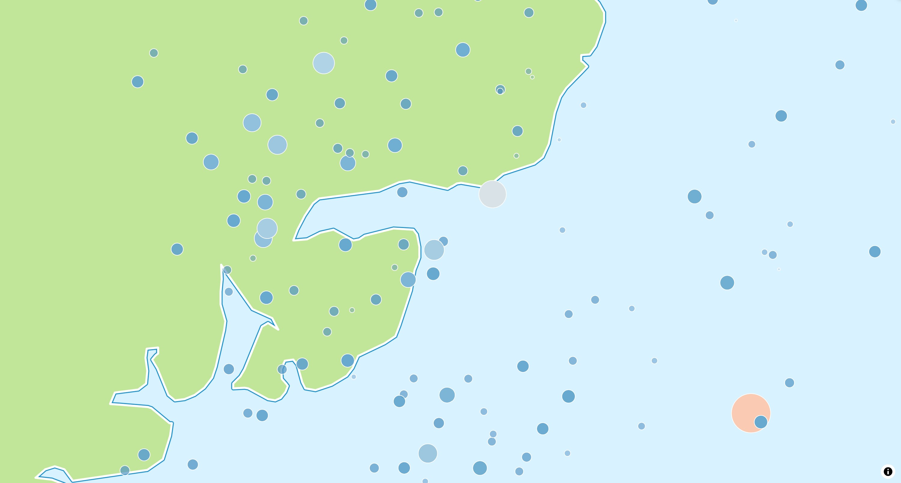

# Circle Style Layer

The `CircleStyleLayer` is either used by the map style or can be added to the map
programmatically to symbolize data on the map.

[](/demo/#/style-layers/circle)

## Basic Usage

```dart linenums="1" hl_lines="10-15 18-19"
late final MapController _controller;

@override
Widget build(BuildContext context) {
  return MapLibreMap(
      options: MapOptions(center: Geographic(lon: 9.17, lat: 47.68)),
      onMapCreated: (controller) => _controller = controller,
      onStyleLoaded: (style) async {
        // add the source
        const earthquakes = GeoJsonSource(
          id: _sourceId,
          data:
          'https://maplibre.org/maplibre-gl-js/docs/assets/earthquakes.geojson',
        );
        await style.addSource(earthquakes);

        // add the source with a layer on the map
        const layer = CircleStyleLayer(id: _layerId, sourceId: _sourceId);
        await style.addLayer(layer);
      }
  );
}
```

Check out
the [example app](https://github.com/josxha/flutter-maplibre/blob/v0.3.4/examples/lib/layers_circle_page.dart)
to learn more.

## Style & Layout

Use the `paint` property to change the style and the `layout`
property to change the behavior on the map.

Read the [Paint & Layout](./z-paint-and-layout) chapter to learn more on this
topic. 