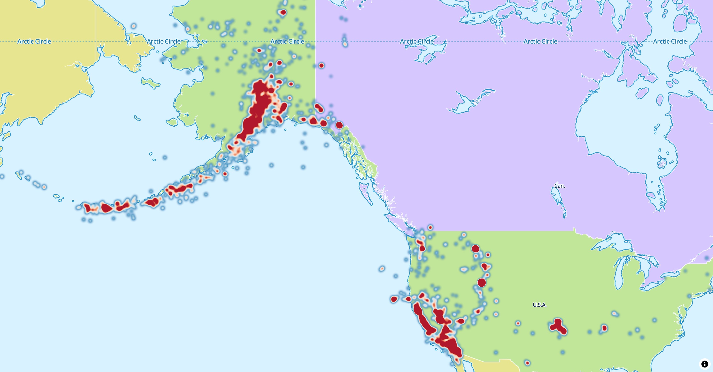

# Heatmap Style Layer

The `HeatmapStyleLayer` is either used by the map style or can be added to the map
programmatically to symbolize data on the map.

[](/demo/#/style-layers/heatmap)

## Basic Usage

```dart linenums="1" hl_lines="9-16"
late final MapController _controller;

@override
Widget build(BuildContext context) {
  return MapLibreMap(
      options: MapOptions(initCamera: .position(center: Geographic(lon: 9.17, lat: 47.68), zoom: 7)),
      onMapCreated: (controller) => _controller = controller,
      onStyleLoaded: (style) async {
        const earthquakes = GeoJsonSource.url(
          id: _sourceId,
          url:
          'https://maplibre.org/maplibre-gl-js/docs/assets/earthquakes.geojson',
        );
        await style.sources.add(earthquakes);
        final layer = HeatmapStyleLayer(id: _layerId, sourceId: _sourceId);
        await style.layers.add(layer);
      }
  );
}
```

Check out
the [example app](https://github.com/josxha/flutter-maplibre/blob/main/examples/lib/style_layers_heatmap_page.dart)
to learn more.

## Style & Layout

Every property of the style spec is an optional parameter and a getter and
setter of the layer. See [Paint & Layout](paint-and-layout) and
[Expressions](expressions).

Read the [Paint & Layout](./paint-and-layout) chapter to learn more on this
topic. 