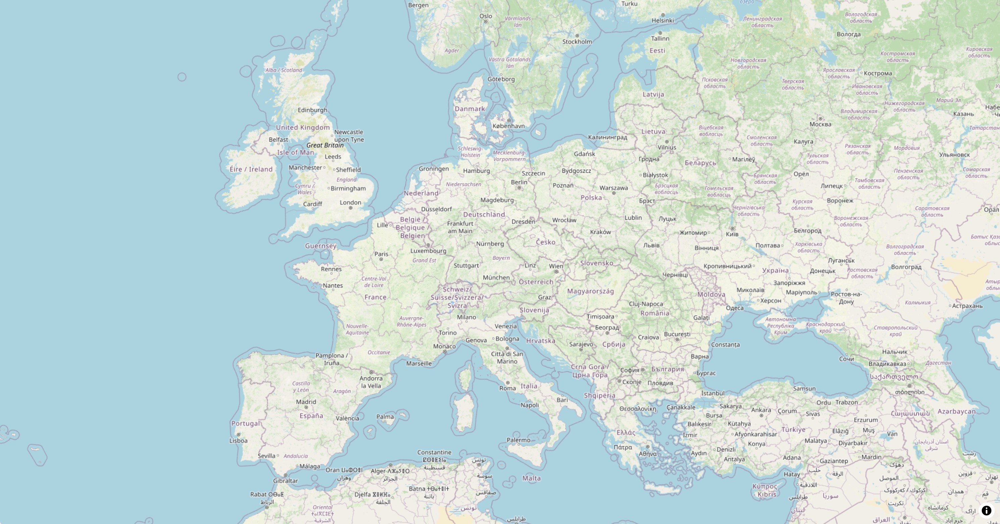

# Raster Style Layer

The `RasterStyleLayer` is either used by the map style or can be added to the map
programmatically to render raster tiles on your map.

[](/demo/#/style-layers/raster)

## Basic Usage

```dart linenums="1" hl_lines="9-23"
late final MapController _controller;

@override
Widget build(BuildContext context) {
  return MapLibreMap(
      options: MapOptions(center: Geographic(lon: 9.17, lat: 47.68)),
      onMapCreated: (controller) => _controller = controller,
      onStyleLoaded: (style) async {
        const openStreetMap = RasterSource(
          id: _sourceId,
          tiles: ['https://tile.openstreetmap.org/{z}/{x}/{y}.png'],
          maxZoom: 20,
          tileSize: 256,
          attribution:
          '<a href="https://www.openstreetmap.org/copyright">OpenStreetMap</a>',
        );
        await style.addSource(openStreetMap);
        const layer = RasterStyleLayer(
          id: _layerId,
          sourceId: _sourceId,
        );
        await style.addLayer(layer);
      }
  );
}
```

Check out
the [example app](https://github.com/josxha/flutter-maplibre/blob/v0.3.4/examples/lib/style_layers_raster_page.dart)
to learn more.

## Style & Layout

Use the `paint` property to change the style and the `layout`
property to change the behavior on the map.

Read the [Paint & Layout](./z-paint-and-layout) chapter to learn more on this
topic. 