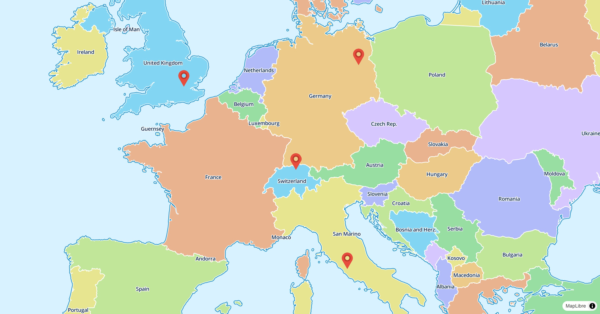

# Symbol Style Layer

The `SymbolStyleLayer` is either used by the map style or can be added to the map
programmatically to symbolize data on the map.

[](/demo/#/style-layers/symbol)

## Basic Usage

```dart linenums="1" hl_lines="14 17-22 25-36"
late final MapController _controller;

@override
Widget build(BuildContext context) {
  return MapLibreMap(
      options: MapOptions(center: Geographic(lon: 9.17, lat: 47.68)),
      onMapCreated: (controller) => _controller = controller,
      onStyleLoaded: (style) async {
        // load the image data
        final response = await http.get(Uri.parse(StyleLayersSymbolPage.imageUrl));
        final bytes = response.bodyBytes;

        // add the image to the map
        await style.addImage('marker', bytes);

        // add some points as GeoJSON source to the map
        await style.addSource(
          const GeoJsonSource(
            id: 'points',
            data: _geoJsonString,
          ),
        );

        // display the image on the map
        await style.addLayer(
          const SymbolStyleLayer(
            id: 'images',
            sourceId: 'points',
            layout: {
              // see https://maplibre.org/maplibre-style-spec/layers/#symbol
              'icon-image': 'marker',
              'icon-size': 0.08,
              'icon-anchor': 'bottom',
            },
          ),
        );
      }
  );
}
```

Check out
the [example app](https://github.com/josxha/flutter-maplibre/blob/v0.3.4/examples/lib/style_layers_symbol_page.dart)
to learn more.

## Style & Layout

Use the `paint` property to change the style and the `layout`
property to change the behavior on the map.

Read the [Paint & Layout](./z-paint-and-layout) chapter to learn more on this
topic. 